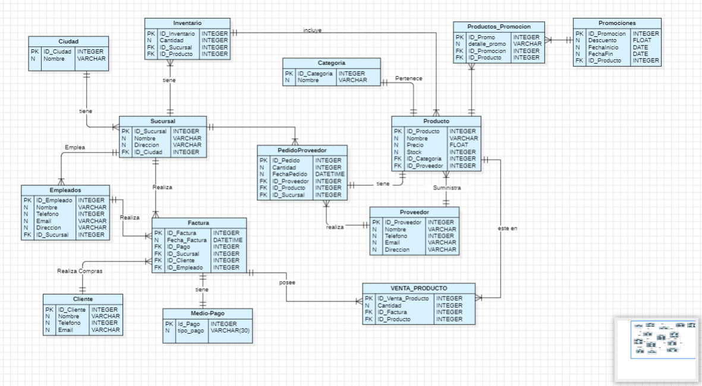

# SupermercadoSQL 🧑🏻‍💼🧺🥑

Base de Datos para una cadena nacional de supermercados

- [Descripción](#descripción)
- [Requerimientos Funcionales](#requerimientosfuncionales)
- [Requerimientos Tecnicos](#requerimientostecnicos)
- [Diagrama E-R](#diagrama)
- [Lenguajes](#lenguajes)
- [Uso](#uso)
- [Desarrollado](#desarrollado)

# Descripcion 📖
Una cadena de supermercados necesita un sistema de gestión que le permita controlar de manera eficiente sus operaciones diarias. 
El sistema debe manejar información sobre los productos que ofrece, las ventas que realiza, el inventario en cada sucursal, los empleados, 
los proveedores y las promociones.

Se desea optimizar la gestión de información y facilitar el acceso a datos mediante consultas SQL.

# Requerimientos Funcionales ⚙️⚙️
- Gestión de Productos:
Almacenar información sobre cada producto que ofrece la cadena, como nombre, precio, stock, y categoría.
Relacionar los productos con sus proveedores y las promociones vigentes.
- Gestión de Categorías:
Clasificar los productos en categorías (Alimentos, Bebidas, Limpieza, etc.).
- Gestión de Sucursales:
Registrar las distintas sucursales de la cadena, cada una con sus propios empleados, inventario, y ventas.
- Gestión de Clientes:
Almacenar información sobre los clientes que realizan compras en las sucursales.
- Gestión de Ventas:
Registrar las ventas realizadas en cada sucursal, incluyendo los detalles de los productos vendidos y los clientes que los adquirieron.
- Gestión de Proveedores:
Almacenar datos sobre los proveedores que suministran los productos a la cadena.
- Gestión de Inventario:
Controlar el stock de productos en cada sucursal, permitiendo consultar productos con bajo inventario.
- Gestión de Empleados:
Almacenar información sobre los empleados de cada sucursal.
- Gestión de Promociones:
Almacenar promociones y descuentos que aplican a ciertos productos durante períodos específicos.
- Pedidos a Proveedores:
Registrar y gestionar los pedidos realizados a proveedores para mantener el inventario abastecido.

# Requerimientos Tecnicos 🛠️🛠️

- Base de Datos Relacional:

Crear una base de datos en MySQL con al menos 10 entidades principales (tablas) que representen las áreas funcionales descritas.
Cada entidad debe tener al menos 20 registros.
- Consultas SQL:
Desarrollar 40 consultas diferentes que permitan extraer información útil para la gestión del supermercado:
Consultas básicas como selección de productos, sucursales o empleados.
Consultas agregadas (sumas, promedios, conteos).
Consultas que incluyan JOIN entre múltiples tablas.
Consultas que usen GROUP BY, ORDER BY, y subconsultas.
Todas las consultas deben estar bien documentadas en el archivo README.md.

- Documentación:
DDL (Data Definition Language): archivo .sql con la creación de la base de datos y sus tablas.
DML (Data Manipulation Language): archivo .sql con las inserciones para poblar las tablas con datos (mínimo 20 registros por tabla).
DQL (Data Query Language): archivo .sql con las 40 consultas SQL y sus respectivas explicaciones.
Un README.md bien estructurado que explique cómo funciona la base de datos, sus entidades, las relaciones entre ellas, y cómo realizar las consultas.
- Organización en Repositorio:
Crear un repositorio ordenado donde se incluya:
El archivo .sql con la creación de la base de datos y tablas (ddl.sql).
El archivo .sql con las inserciones de datos (dml.sql).
El archivo .sql con las consultas SQL (dql.sql).
Un README.md detallado.

# Diagrama E-R

Diagramado de la Base de Datos.. 📋

# Lenguaje

Base de datos en MySQL 
>[!note]
>Se utilizaron DDL para la creacion  en la creacion de las tablas de la base de datos *supermercado*.

CREATE DATABASE IF NOT EXISTS supermercado;

USE supermercado;

CREATE TABLE IF NOT EXISTS CIUDAD (
    ID_Ciudad INTEGER PRIMARY KEY AUTO_INCREMENT,
    Nombre_Ciudad VARCHAR(50) NOT NULL
);

CREATE TABLE IF NOT EXISTS CATEGORIA (
    Id_Categoria INTEGER PRIMARY KEY AUTO_INCREMENT,
    Nombre_Categoria VARCHAR(50) NOT NULL
);

CREATE TABLE IF NOT EXISTS PROVEEDOR (
    ID_Proveedor INTEGER PRIMARY KEY AUTO_INCREMENT,
    Nombre VARCHAR(50) NOT NULL,
    Telefono VARCHAR(15) NOT NULL,
    Email VARCHAR(60) NOT NULL UNIQUE,
    Direccion VARCHAR(50) NOT NULL
);

CREATE TABLE IF NOT EXISTS CLIENTE (
    ID_Cliente INTEGER PRIMARY KEY  UNIQUE, 
    Nombre_cliente VARCHAR(60) NOT NULL,
    Telefono VARCHAR(15) NOT NULL,
    Email VARCHAR(60) NOT NULL UNIQUE
    );

CREATE TABLE IF NOT EXISTS MEDIO_PAGO (
    ID_Pago INTEGER PRIMARY KEY AUTO_INCREMENT,
    Tipo_Pago VARCHAR(30) NOT NULL
);

CREATE TABLE IF NOT EXISTS PRODUCTO (
    Id_producto INTEGER PRIMARY KEY AUTO_INCREMENT,
    Nombre_Producto VARCHAR(50) NOT NULL,
    Precio_producto FLOAT NOT NULL,
    stock INTEGER NOT NULL,
    ID_categoria INTEGER NOT NULL,
    ID_Proveedor INTEGER NOT NULL,
    FOREIGN KEY (ID_categoria) REFERENCES CATEGORIA(Id_Categoria),
    FOREIGN KEY (ID_Proveedor) REFERENCES PROVEEDOR(ID_Proveedor)
);

CREATE TABLE IF NOT EXISTS MARCA (
    ID_Marca INTEGER PRIMARY KEY AUTO_INCREMENT,
    Nombre VARCHAR(50) NOT NULL,
    Descripcion VARCHAR(80) NOT NULL
);

CREATE TABLE IF NOT EXISTS SUCURSAL (
    Id_Sucursal INTEGER PRIMARY KEY AUTO_INCREMENT,
    Nombre_sucursal VARCHAR(50) NOT NULL,
    direccion_sucursal VARCHAR(50) NOT NULL,
    ID_Ciudad INTEGER NOT NULL,
    FOREIGN KEY (ID_Ciudad) REFERENCES CIUDAD(ID_Ciudad)
);

CREATE TABLE IF NOT EXISTS EMPLEADO (
    ID_Empleado INTEGER PRIMARY KEY UNIQUE,
    Nombre_empleado VARCHAR(60) NOT NULL,
    Telefono VARCHAR(15) NOT NULL,
    Email VARCHAR(60) NOT NULL UNIQUE,
    Direccion VARCHAR(50) NOT NULL,
    ID_Sucursal INTEGER NOT NULL,
    FOREIGN KEY (ID_Sucursal) REFERENCES SUCURSAL(Id_Sucursal)
);

CREATE TABLE IF NOT EXISTS VENTA (
    ID_venta INTEGER PRIMARY KEY AUTO_INCREMENT,
    Fecha_Venta DATETIME NOT NULL,
    ID_Pago INTEGER NOT NULL,
    ID_Sucursal INTEGER NOT NULL,
    ID_Cliente INTEGER NOT NULL,
    ID_Empleado INTEGER NOT NULL,
    FOREIGN KEY (ID_Pago) REFERENCES MEDIO_PAGO(ID_Pago),
    FOREIGN KEY (ID_Sucursal) REFERENCES SUCURSAL(Id_Sucursal),
    FOREIGN KEY (ID_Cliente) REFERENCES CLIENTE(ID_Cliente),
    FOREIGN KEY (ID_Empleado) REFERENCES EMPLEADO(ID_Empleado)
);

CREATE TABLE IF NOT EXISTS INVENTARIO (
    ID_Inventario INTEGER PRIMARY KEY AUTO_INCREMENT,
    Cantidad INTEGER NOT NULL,
    ID_Sucursal INTEGER NOT NULL,
    ID_Producto INTEGER NOT NULL,
    FOREIGN KEY (ID_Sucursal) REFERENCES SUCURSAL(Id_Sucursal),
    FOREIGN KEY (ID_Producto) REFERENCES PRODUCTO(Id_producto)
);

CREATE TABLE IF NOT EXISTS PROMOCION (
    ID_Promocion INTEGER PRIMARY KEY AUTO_INCREMENT,
    Descuento FLOAT NOT NULL,
    Fecha_Inicio DATE NOT NULL,
    Fecha_Fin DATE NOT NULL,
    ID_Producto INT NOT NULL,
    FOREIGN KEY (ID_Producto) REFERENCES PRODUCTO(Id_producto)
);

CREATE TABLE IF NOT EXISTS PRODUCTOS_PROMOCION (
    ID_Promo INTEGER PRIMARY KEY AUTO_INCREMENT,
    Detalle_Promo VARCHAR(50) NOT NULL,
    ID_Promocion INTEGER NOT NULL,
    ID_Producto INTEGER NOT NULL,
    FOREIGN KEY (ID_Producto) REFERENCES PRODUCTO(Id_producto),
    FOREIGN KEY (ID_Promocion) REFERENCES PROMOCION(ID_Promocion)
);

CREATE TABLE IF NOT EXISTS Pedido_Proveedor (
    ID_Pedido INTEGER PRIMARY KEY AUTO_INCREMENT,
    Cantidad INTEGER NOT NULL,
    Fecha_Pedido DATETIME NOT NULL,
    ID_Proveedor INTEGER NOT NULL,
    ID_Producto INTEGER NOT NULL,
    ID_Sucursal INTEGER NOT NULL,
    FOREIGN KEY (ID_Proveedor) REFERENCES PROVEEDOR(ID_Proveedor),
    FOREIGN KEY (ID_Producto) REFERENCES PRODUCTO(Id_producto),
    FOREIGN KEY (ID_Sucursal) REFERENCES SUCURSAL(Id_Sucursal)
);

CREATE TABLE IF NOT EXISTS FACTURA_CLIENTE (
    ID_Detalle_Factura INTEGER PRIMARY KEY AUTO_INCREMENT,
    Cantidad INTEGER NOT NULL,
    ID_Venta INTEGER NOT NULL,
    ID_Producto INTEGER NOT NULL,
    FOREIGN KEY (ID_Venta) REFERENCES VENTA(ID_venta),
    FOREIGN KEY (ID_Producto) REFERENCES PRODUCTO(Id_producto)
);

# Uso

> [!important]
> Abrir el repositorio y descargar su contenido
> descomprimir el zip 
> Ingresa al programa MySQL Workbench y abre los scripts que se encuentran dentro de la carpeta del repositorio previamente descomprimida
> listo ya se ecuentra dentro de la DB.

# Desarolladores 

Laura Carrillo - Tecnologa en Desarrollo de Sistemas Informaticos
| @cordilauoficial |  

Felipe Velandia - Camper
| @velandia____ | 

> [!WARNING]
> Algunas consultas se encuentran en revision por  estructuracion deficiente.
